# TrafficVigil 密网巡哨安装说明与页面效果图

本文档用于作品提交、评审复现和本地演示。内容包含环境准备、安装运行、构建部署、常见问题和完整页面效果图。

## 1. 作品概览

TrafficVigil 密网巡哨是一个面向加密网络流量识别、行为分析和公共群组溯源的安全分析平台。作品提供从 PCAP 数据接入、VPN / SIM 分类、IM 应用识别、用户行为嗅探、群组关联分析到报告生成的完整闭环。

核心页面包括：

- 登录页
- 数据中心
- 流量捕获
- 综合检测
- VPN 分析
- SIM 分析
- 行为嗅探
- 群组匹配
- 报告中心
- 模型展示
- 任务历史
- 系统设置

## 2. 环境要求

推荐环境：

| 组件 | 版本要求 | 说明 |
| --- | --- | --- |
| Node.js | 22+ | 前端构建与本地预览 |
| pnpm | 10+ | 前端依赖管理 |
| Python | 3.10+ | 后端分析流程与命令行示例 |
| Git | 2.40+ | 拉取仓库与部署 |
| 浏览器 | Chrome / Edge / Firefox | 作品演示与截图查看 |

当前项目使用：

```text
React 19
Vite 7
TypeScript 5
Tailwind CSS 4
pnpm 10
Python setuptools
```

## 3. 获取作品代码

```bash
git clone https://github.com/LaplaceYoung/-miwang-trafficvigil.git
cd -miwang-trafficvigil
```

仓库主要目录：

```text
.
├── frontend/src/                         # 前端页面、组件、状态与数据
├── src/trafficvigil/                     # Python 分析流程
├── assets/screenshots/                   # 页面效果图
├── docs/                                 # 作品文档
├── examples/sample-task.json             # 示例任务数据
├── prototype/traffic_vigil_prototype_app.jsx
├── package.json
├── pyproject.toml
└── vite.config.ts
```

## 4. 安装前端依赖

项目使用 pnpm。首次运行时执行：

```bash
pnpm install
```

依赖安装完成后，`node_modules/` 会在本地生成。

## 5. 本地启动作品

启动开发服务器：

```bash
pnpm dev
```

默认访问地址：

```text
http://127.0.0.1:5173
```

进入页面后点击「演示账号进入」即可进入控制台。也可以使用：

```text
账号：admin
密码：123456
```

## 6. 本地构建与预览

生成静态构建产物：

```bash
pnpm build
```

构建输出目录：

```text
dist/
```

本地预览构建产物：

```bash
pnpm exec vite preview --host 127.0.0.1 --port 5174
```

访问：

```text
http://127.0.0.1:5174
```

## 7. Python 分析流程安装

Python 包配置位于 `pyproject.toml`，本地开发安装命令：

```bash
python -m pip install -e .
```

查看命令行入口：

```bash
python -m trafficvigil --help
```

运行示例形式：

```bash
python -m trafficvigil <授权PCAP文件路径> --task-id case-001 --output data/output/case-001.json
```

说明：

- 输入文件应为合法授权采集的 `.pcap` 或 `.pcapng`。
- 输出结果建议保存到 `data/output/`。
- 前端原型内置了展示用样例数据，评审演示可直接运行前端。

## 8. GitHub Pages 部署

前端采用静态部署，`vite.config.ts` 已设置：

```ts
base: "./"
```

构建命令：

```bash
pnpm build
```

部署目标目录：

```text
dist/
```

线上地址：

```text
https://laplaceyoung.github.io/-miwang-trafficvigil/
```

推荐部署流程：

1. 执行 `pnpm build`。
2. 将 `dist/` 内容发布到 `gh-pages` 分支。
3. 在 GitHub 仓库 Settings -> Pages 中选择 `gh-pages` 分支。
4. 等待 GitHub Pages 完成发布。
5. 打开线上地址检查页面、图标、图表交互和报告预览。

## 9. 验收检查

本地验收命令：

```bash
pnpm build
python -m trafficvigil --help
```

页面验收重点：

- 数据中心 IM 应用分布完整显示 Telegram、WhatsApp、Signal、WeChat、QQ 等图标。
- 柱状图、折线图、饼状图支持 hover 数据预览或点击跳转。
- 页面在常规桌面宽度下没有横向滚动。
- 通知按钮可以展开菜单、标记已读并跳转到对应页面。
- 设置页可以切换选项、刷新身份密钥、保存配置。
- 报告页可以筛选报告、全屏预览、导出文件。
- 任务页支持状态筛选、复现和删除操作。

## 10. 页面效果图

以下截图由本地最新构建生成，保存于 `assets/screenshots/`。

### 10.1 登录页

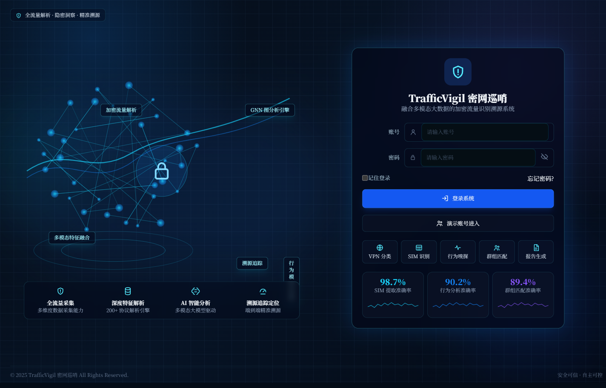

### 10.2 数据中心

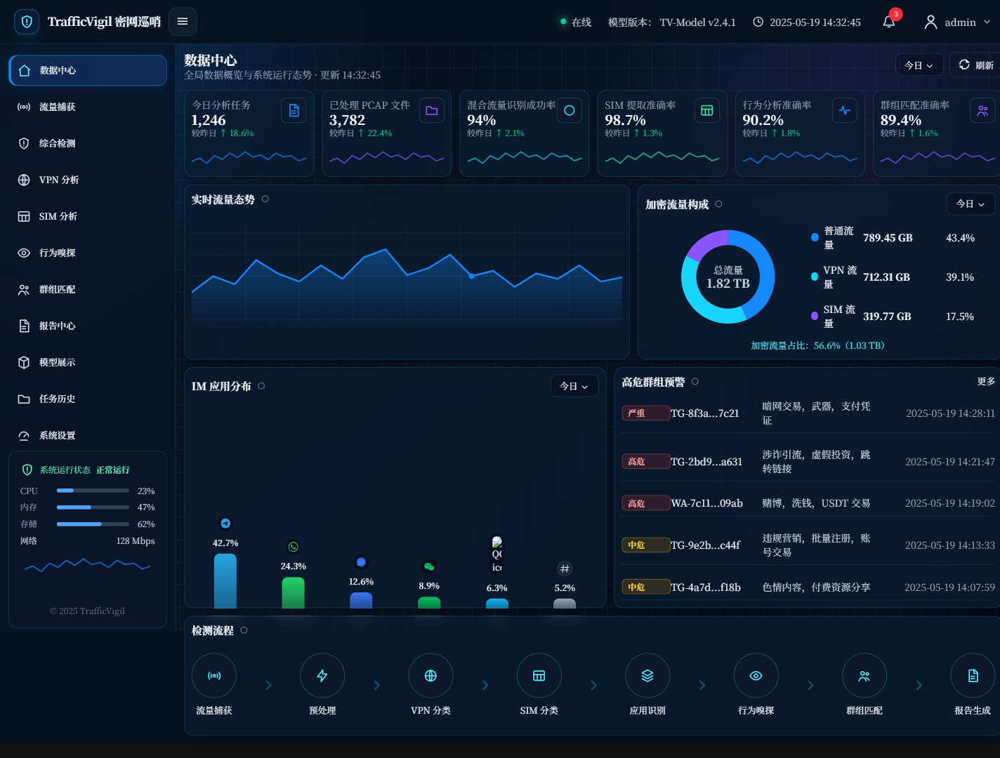

### 10.3 流量捕获

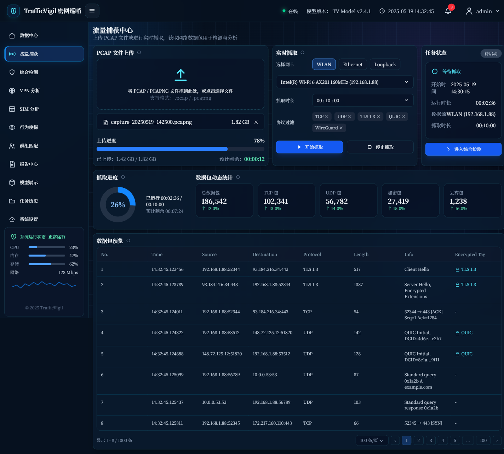

### 10.4 综合检测

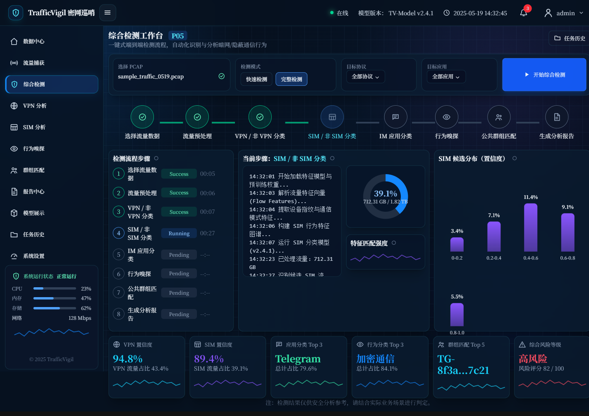

### 10.5 VPN 分析

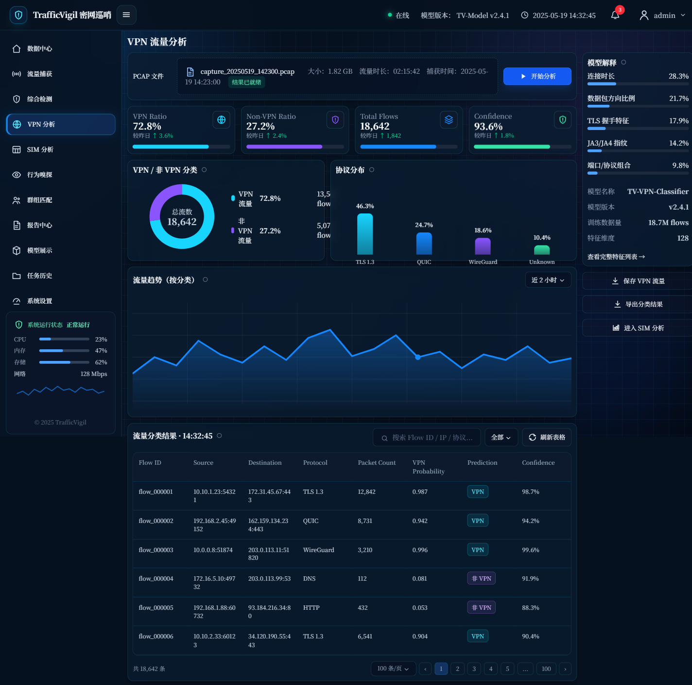

### 10.6 SIM 分析

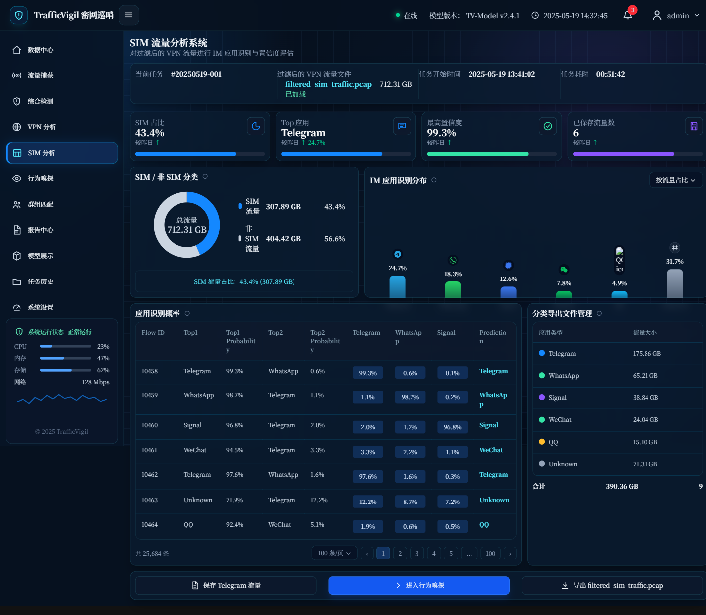

### 10.7 行为嗅探

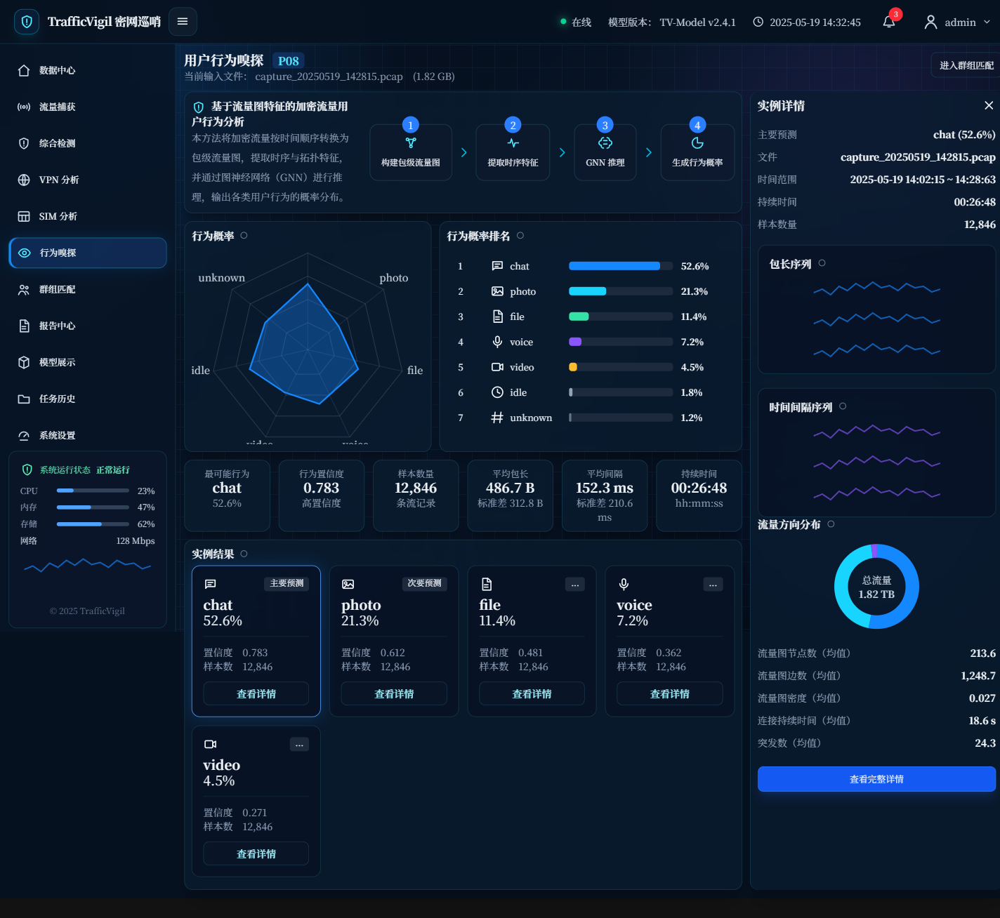

### 10.8 群组匹配

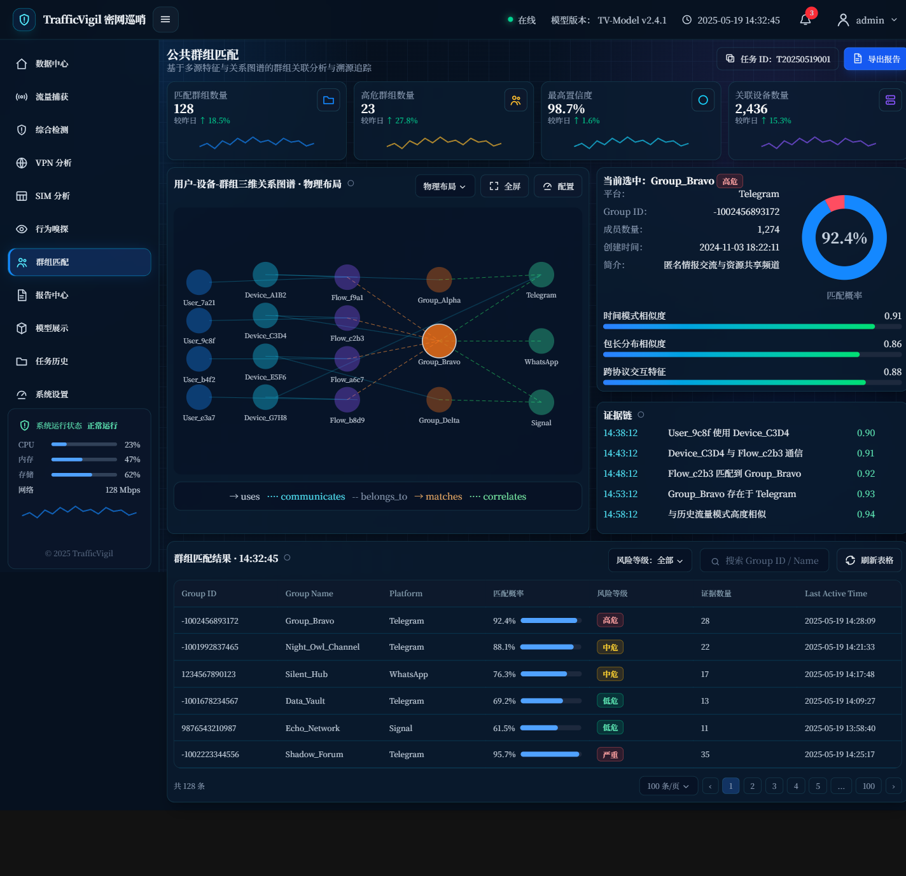

### 10.9 报告中心

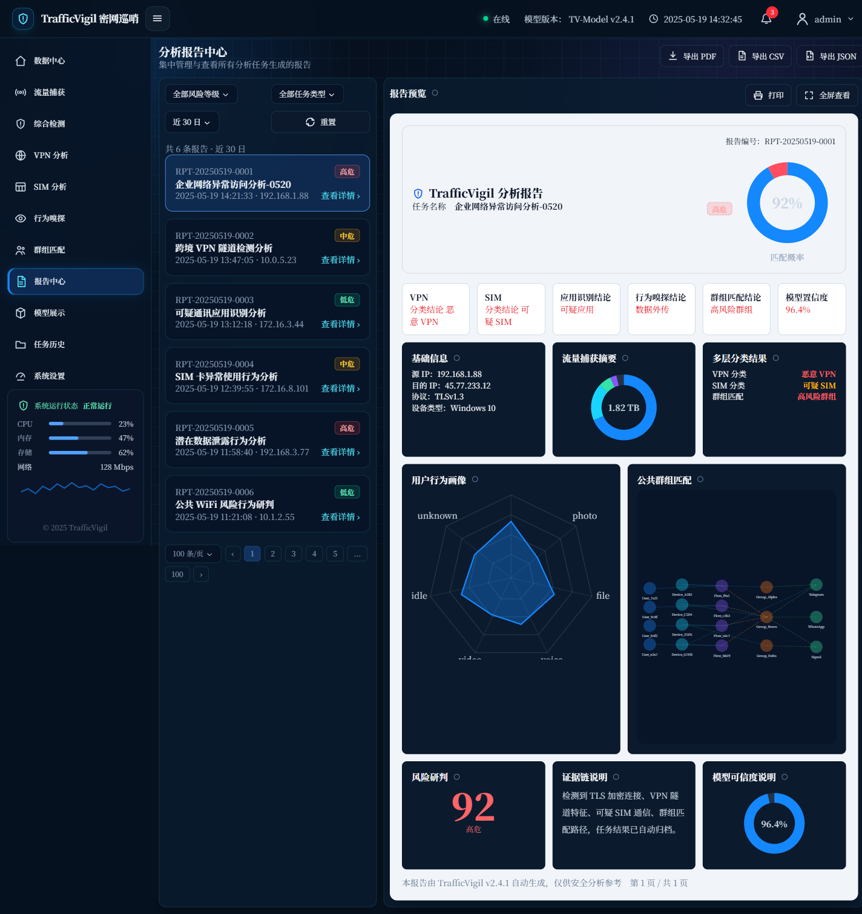

### 10.10 模型展示

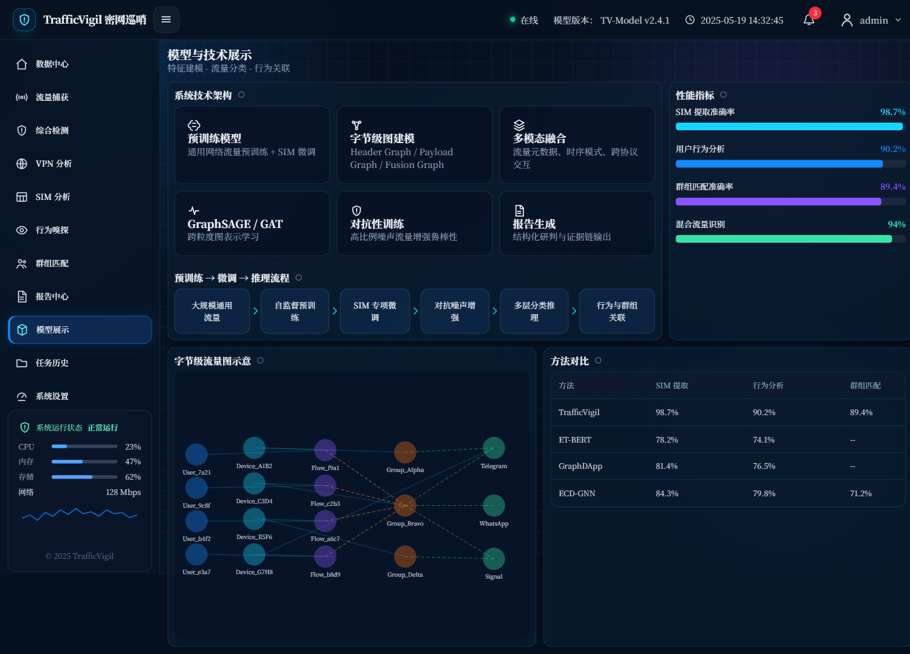

### 10.11 任务历史

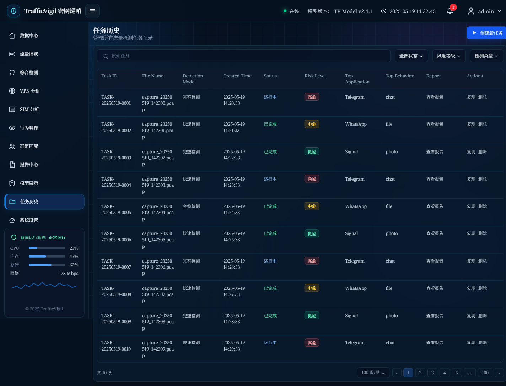

### 10.12 系统设置

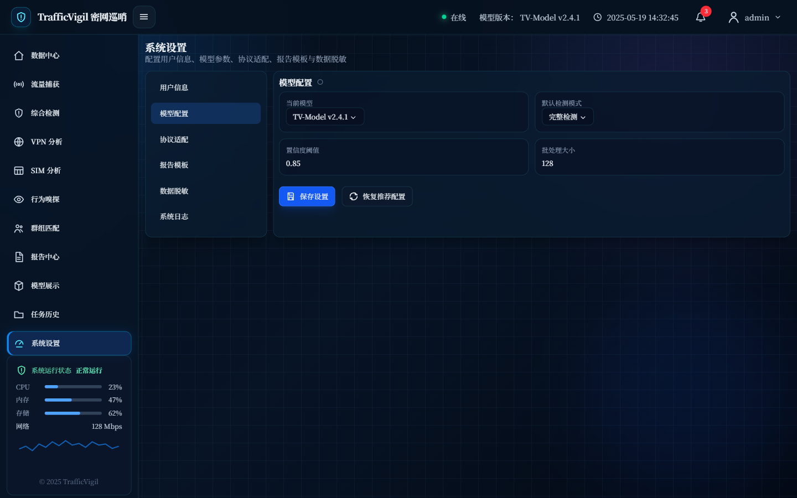

## 11. 常见问题

### 11.1 `pnpm` 命令不存在

先安装或启用 pnpm：

```bash
corepack enable
corepack prepare pnpm@10.26.0 --activate
```

然后重新执行：

```bash
pnpm install
```

### 11.2 端口被占用

开发服务器默认使用 `5173`。可以指定其他端口：

```bash
pnpm exec vite --host 127.0.0.1 --port 5175
```

构建预览可指定：

```bash
pnpm exec vite preview --host 127.0.0.1 --port 5176
```

### 11.3 GitHub Pages 页面空白

检查 `vite.config.ts` 中是否保留：

```ts
base: "./"
```

然后重新执行：

```bash
pnpm build
```

### 11.4 图标加载失败

IM 官方图标来自 Simple Icons CDN。离线环境下图标可能无法显示，页面会保留应用名称、数值和 Unknown 兜底图标。

### 11.5 Python 命令无法运行

确认 Python 版本：

```bash
python --version
```

安装本地包：

```bash
python -m pip install -e .
```

再次检查：

```bash
python -m trafficvigil --help
```

## 12. 评审演示建议

推荐演示顺序：

1. 登录页：展示作品入口、系统定位和核心指标。
2. 数据中心：展示全局态势、IM 应用分布和检测流程。
3. 流量捕获：展示 PCAP 上传、实时抓取和数据包预览。
4. 综合检测：展示端到端流水线。
5. VPN 分析与 SIM 分析：展示分类结果、图表交互和导出能力。
6. 行为嗅探：展示行为概率、实例详情和流量方向分布。
7. 群组匹配：展示用户、设备、流、群组的关系图谱。
8. 报告中心：展示筛选、预览、打印和导出。
9. 模型展示：说明技术路线、指标和方法对比。
10. 系统设置与任务历史：展示工程完整度和可维护性。

